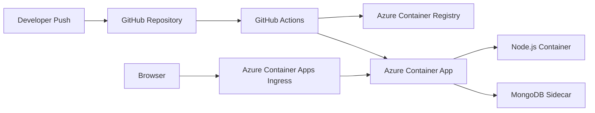

# Azure Bonus Architecture

```mermaid
flowchart LR
    DEV[Developer Push] --> GH[GitHub Repository]
    GH --> GHA[GitHub Actions]
    GHA --> ACR[Azure Container Registry]
    GHA --> ACA[Azure Container App]

    ACA --> APP[Node.js Container]
    ACA --> MONGO[MongoDB Sidecar]

    USER[Browser] --> INGRESS[Azure Container Apps Ingress]
    INGRESS --> ACA
```