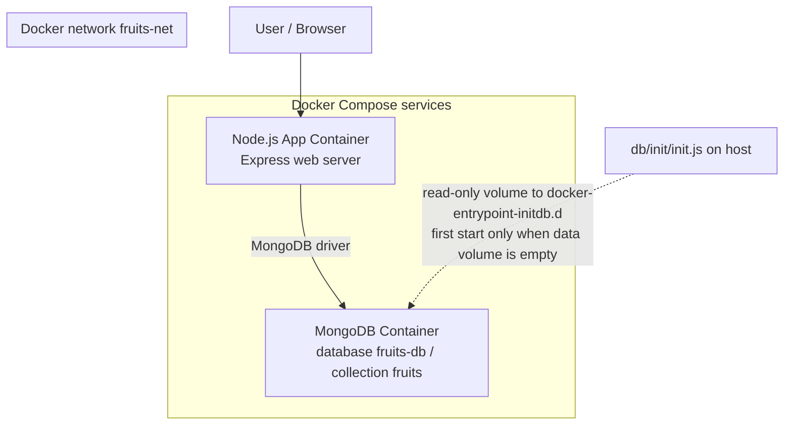

# Architecture Diagram

Two long-running containers (`app`, `mongo`) are defined in Compose. Database seeding is not a third container: `db/init/init.js` is mounted into the MongoDB image’s `/docker-entrypoint-initdb.d` and runs **once** when the data volume is empty.

