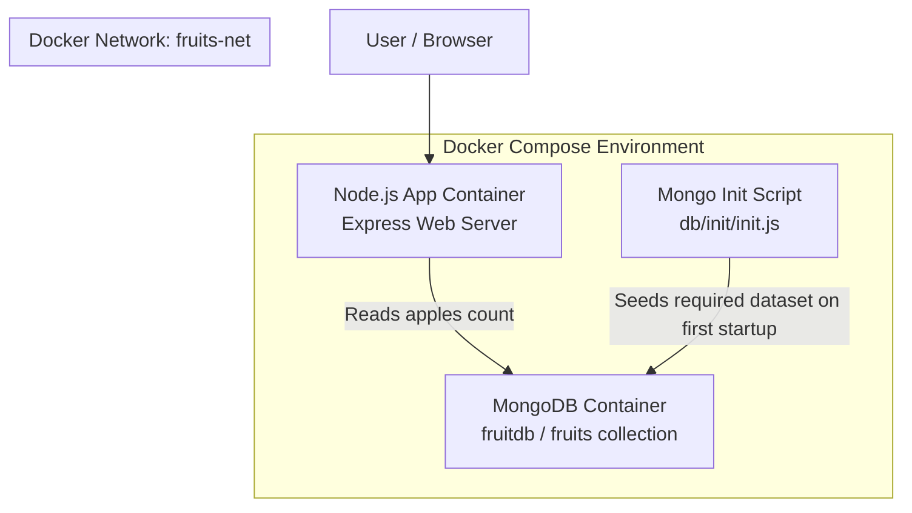

# Architecture Diagram

```mermaid
flowchart TD
    U[User / Browser] --> A[Node.js App Container<br/>Express Web Server]
    A -->|Reads apples count| M[MongoDB Container<br/>fruitdb / fruits collection]

    I[Mongo Init Script<br/>db/init/init.js] -->|Seeds required dataset on first startup| M

    subgraph D[Docker Compose Environment]
        A
        M
        I
    end

    subgraph N[Docker Network: fruits-net]
        A
        M
    end
```
